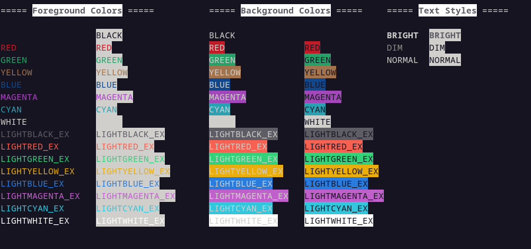

# crolorama

Easy text coloring and styling in Crystal. Currently only support for systems with ANSI support.

Tested only on Linux.

## Installation

1. Add the dependency to your `shard.yml`:

   ```yaml
   dependencies:
     crolorama:
       github: js-on/crolorama
   ```

2. Run `shards install`

## Usage

```crystal
require "crolorama"
crol = Crolorama::Crolor.new

puts "This is #{crol.fg("red")}RED#{crol.reset}"
```

### Available methods
- Change foreground color: `crol.fg`
- Change background color: `crol.bg`
- Change text style: `crol.style`
- Reset colors: `crol.reset`
- Reset all (including styles): `crol.reset_all`

**Experimental**
- Move cursor *n* lines up: `crol.up n`
- Move cursor *n* lines down: `crol.down n`
- Move cursor *n* lines forward: `crol.forward n`
- Move cursor *n* lines back: `crol.back n`
- Position cursor at *x* across, *y* down: `crol.pos x, y`


**Example:** `crystal run src/example.cr`

**Available colors:** `crystal run src/colors.cr`



## Development

This shard is mainly oriented towards the [colorama](https://pypi.org/project/colorama/) module of python. In case you wanna add new features, see <a href="user-content-contributing">Contributing</a>.

## Contributing

1. Fork it (<https://github.com/your-github-user/crolorama/fork>)
2. Create your feature branch (`git checkout -b my-new-feature`)
3. Commit your changes (`git commit -am 'Add some feature'`)
4. Push to the branch (`git push origin my-new-feature`)
5. Create a new Pull Request

## Contributors

- [js-on](https://github.com/your-github-user) - creator and maintainer
